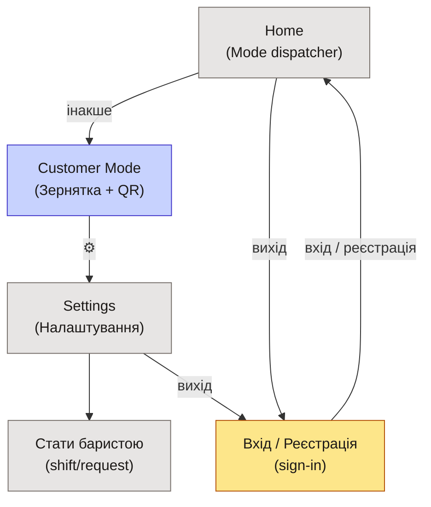
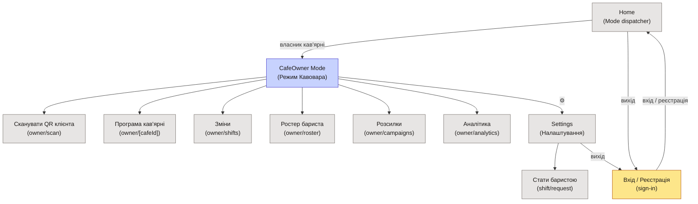
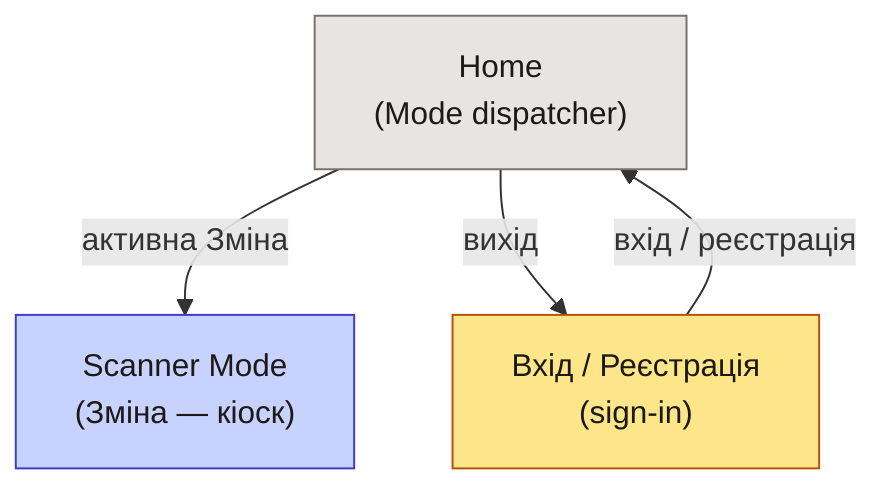
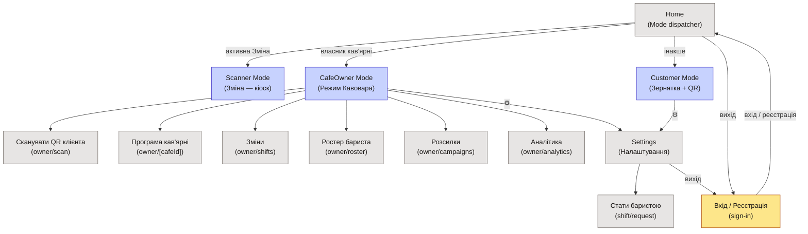

<!-- GENERATED by apps/mobile/scripts/gen-flow-map.mjs — DO NOT EDIT BY HAND.
     Regenerate with `pnpm --filter @kavtsya/mobile flows:map`. -->

# User-flow maps

Derived from the Expo Router tree (`apps/mobile/src/app`) and the app's real
navigation call-sites. The three Role Modes (ADR 0015) are the surfaces
`index` dispatches to by live account facts — active Зміна → Scanner, else a
CafeOwner → CafeOwner, else Customer.

## Customer

## CafeOwner

## Scanner (Barista on shift)

## Combined

